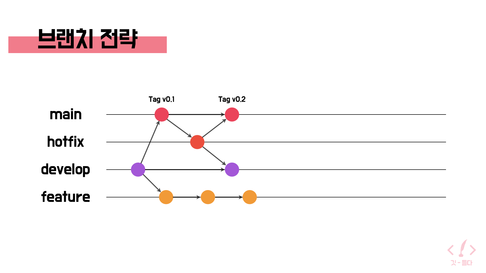

# 🧭 코딩 컨벤션

## 0. 🎯 목적

- **가독성 및 일관성**: 누가 작성해도 비슷한 스타일의 코드를 유지
- **효율성**: 코드 리뷰 시간 단축 및 신규 팀원 빠른 적응
- **안정성**: 버그 발생 가능성 최소화 및 유지보수 비용 절감

---

## 1. 🧱 공통

### 1.1. 코딩 스타일

- 들여쓰기: 탭 사용, 스페이스 사용 금지 (2칸)
- 세미콜론: 문장 끝에 항상 사용
- 문자열: `'작은따옴표'` 기본, 변수 삽입 시 `템플릿 리터럴`
- 변수 선언: `const` 기본, 재할당 시 `let` 사용 (`var` 금지)
- 동등 비교: `===`, `!==` 사용
- Nullish 연산자: `??` 권장, `||`는 논리적 OR일 때만 사용

### 1.2. 네이밍 컨벤션

| 항목                 | 규칙                                         | 예시                               |
| -------------------- | -------------------------------------------- | ---------------------------------- |
| 변수/함수            | `camelCase`                                  | `userProfile` ⭕ / `uProf` ❌      |
| 불리언               | `is`, `has`, `can`, `should` 접두어          | `isLoggedIn`, `hasPermission`      |
| 타입/클래스/컴포넌트 | `PascalCase`                                 | `UserInfo`, `ApiService`           |
| 전역 상수            | `SCREAMING_SNAKE_CASE`                       | `MAX_REQUEST_COUNT`                |
| 폴더/파일            | `kebab-case` (React 컴포넌트는 `PascalCase`) | `user-service/`, `UserProfile.tsx` |
| NestJS 파일          | 접미사 명확히                                | `*.controller.ts`, `*.dto.ts` 등   |

### 1.3. 주석 및 문서화

- "무엇"이 아닌 "왜"를 설명
- JSDoc: 공용 함수/API/DTO에 타입 및 설명 명시

---

## 2. 🎨 프론트엔드 (React + TypeScript + TailwindCSS)

### 2.1. 컴포넌트 작성 규칙

- 함수형 컴포넌트 사용
- Props 타입 명확히 정의, 선택적 prop 구분
- 이벤트 핸들러는 `handle` 접두어 사용 (`handleClick`)
- 리스트 렌더링 시 `index` 대신 고유 `id`를 `key`로 사용
- 접근성 고려: 시맨틱 태그 사용, ``에는 `alt` 필수

### 2.2. 상태 관리

- 파생 상태 금지: 서버 데이터를 그대로 `useState`에 저장 ❌
- useEffect 의존성 배열: 명확하게 관리

### 2.3. 스타일링 (TailwindCSS)

- 인라인 스타일 지양: `style={{ color: 'red' }}` ❌
- 반복 클래스는 컴포넌트화 또는 `clsx`, `tailwind-merge` 활용

---

## 3. ⚙️ 백엔드 (NestJS + TypeScript)

### 3.1. 핵심 컨벤션

- DI: `private readonly` 생성자 주입
- DTO: 목적 명확히 (`CreateUserDto`, `UpdateUserDto`)
- 유효성 검사: `class-validator`, `ValidationPipe` 사용
- 예외 처리: `HttpException`, 전역 필터로 일관된 응답 유지
- API 문서화: Swagger(OpenAPI)로 자동 생성 및 최신 유지

### 3.2. 데이터베이스 (TypeORM/Prisma)

- 테이블/컬럼: `snake_case` 사용 (`user_profiles`, `created_at`)
- 공통 컬럼: `id`, `created_at`, `updated_at` 포함 권장
- 마이그레이션: 반드시 파일로 관리

### 3.3. API 규약

- 버전 관리: `/api/v1` 형식
- RESTful 원칙: 복수 명사 + HTTP 메서드 (`GET /users`)
- 응답 형식: `{ data: T }` 또는 `{ data: T, meta: { ... } }`

---

## 4. 🚀 워크플로우 (Git)

### 4.1. 브랜치 전략



- 브랜치 이름: 목적 명확히 (`feature/`, `fix/`, `refactor/`)
- 예시: `feature/login-page`, `fix/user-auth-bug`

### 4.2. 커밋 메시지

- Conventional Commits 형식: `type(scope): subject`

| 타입       | 설명                                     |
| ---------- | ---------------------------------------- |
| `feat`     | 새로운 기능 추가                         |
| `fix`      | 버그 수정                                |
| `docs`     | 문서 변경                                |
| `style`    | css 스타일 수정                          |
| `format`   | 코드 스타일(줄 위치, 따옴표 등) 수정     |
| `refactor` | 기능 변경 없는 리팩토링 (변수명 수정 등) |
| `test`     | 테스트 코드 관련                         |
| `chore`    | 빌드, 패키지, 환경변수 등 기타 변경      |

### 4.3. git repository 구조

```
Project-CineTrip
├─ backend
│  ├─ .pnp.cjs
│  ├─ .pnp.loader.mjs
│  ├─ .prettierrc
│  ├─ .yarn
│  │  ├─ install-state.gz
│  │  └─ unplugged
│  │     ├─ @nestjs-core-virtual-76c27c62bb
│  │     ├─ @scarf-scarf-npm-1.4.0-f6114c29f9
│  │     ├─ @unrs-resolver-binding-win32-x64-msvc-npm-1.11.1-4121c06678
│  │     ├─ bcrypt-npm-6.0.0-fb16e34c40
│  │     ├─ node-addon-api-npm-8.5.0-2920c05027
│  │     ├─ node-gyp-npm-11.4.2-75a7da9a3c
│  │     ├─ prettier-npm-3.6.2-2668152203
│  │     └─ unrs-resolver-npm-1.11.1-9828edd1f1
│  ├─ dist
│  │  ├─ app.controller.d.ts
│  │  ├─ app.controller.js
│  │  ├─ app.controller.js.map
│  │  ├─ app.module.d.ts
│  │  ├─ app.module.js
│  │  ├─ app.module.js.map
│  │  ├─ app.service.d.ts
│  │  ├─ app.service.js
│  │  ├─ app.service.js.map
│  │  ├─ main.d.ts
│  │  ├─ main.js
│  │  ├─ main.js.map
│  │  ├─ modules
│  │  │  ├─ auth
│  │  │  │  ├─ auth.controller.d.ts
│  │  │  │  ├─ auth.controller.js
│  │  │  │  ├─ auth.controller.js.map
│  │  │  │  ├─ auth.module.d.ts
│  │  │  │  ├─ auth.module.js
│  │  │  │  ├─ auth.module.js.map
│  │  │  │  ├─ auth.service.d.ts
│  │  │  │  ├─ auth.service.js
│  │  │  │  └─ auth.service.js.map
│  │  │  ├─ checklist
│  │  │  │  ├─ checklist.controller.d.ts
│  │  │  │  ├─ checklist.controller.js
│  │  │  │  ├─ checklist.controller.js.map
│  │  │  │  ├─ checklist.module.d.ts
│  │  │  │  ├─ checklist.module.js
│  │  │  │  ├─ checklist.module.js.map
│  │  │  │  ├─ checklist.service.d.ts
│  │  │  │  ├─ checklist.service.js
│  │  │  │  └─ checklist.service.js.map
│  │  │  ├─ comments
│  │  │  │  ├─ comments.controller.d.ts
│  │  │  │  ├─ comments.controller.js
│  │  │  │  ├─ comments.controller.js.map
│  │  │  │  ├─ comments.module.d.ts
│  │  │  │  ├─ comments.module.js
│  │  │  │  ├─ comments.module.js.map
│  │  │  │  ├─ comments.service.d.ts
│  │  │  │  ├─ comments.service.js
│  │  │  │  └─ comments.service.js.map
│  │  │  ├─ feed
│  │  │  │  ├─ feed.controller.d.ts
│  │  │  │  ├─ feed.controller.js
│  │  │  │  ├─ feed.controller.js.map
│  │  │  │  ├─ feed.module.d.ts
│  │  │  │  ├─ feed.module.js
│  │  │  │  ├─ feed.module.js.map
│  │  │  │  ├─ feed.service.d.ts
│  │  │  │  ├─ feed.service.js
│  │  │  │  └─ feed.service.js.map
│  │  │  ├─ gallery
│  │  │  │  ├─ gallery.controller.d.ts
│  │  │  │  ├─ gallery.controller.js
│  │  │  │  ├─ gallery.controller.js.map
│  │  │  │  ├─ gallery.module.d.ts
│  │  │  │  ├─ gallery.module.js
│  │  │  │  ├─ gallery.module.js.map
│  │  │  │  ├─ gallery.service.d.ts
│  │  │  │  ├─ gallery.service.js
│  │  │  │  └─ gallery.service.js.map
│  │  │  ├─ locations
│  │  │  │  ├─ locations.controller.d.ts
│  │  │  │  ├─ locations.controller.js
│  │  │  │  ├─ locations.controller.js.map
│  │  │  │  ├─ locations.module.d.ts
│  │  │  │  ├─ locations.module.js
│  │  │  │  ├─ locations.module.js.map
│  │  │  │  ├─ locations.service.d.ts
│  │  │  │  ├─ locations.service.js
│  │  │  │  └─ locations.service.js.map
│  │  │  ├─ movies
│  │  │  │  ├─ movies.controller.d.ts
│  │  │  │  ├─ movies.controller.js
│  │  │  │  ├─ movies.controller.js.map
│  │  │  │  ├─ movies.module.d.ts
│  │  │  │  ├─ movies.module.js
│  │  │  │  ├─ movies.module.js.map
│  │  │  │  ├─ movies.service.d.ts
│  │  │  │  ├─ movies.service.js
│  │  │  │  └─ movies.service.js.map
│  │  │  ├─ photos
│  │  │  │  ├─ photos.controller.d.ts
│  │  │  │  ├─ photos.controller.js
│  │  │  │  ├─ photos.controller.js.map
│  │  │  │  ├─ photos.module.d.ts
│  │  │  │  ├─ photos.module.js
│  │  │  │  ├─ photos.module.js.map
│  │  │  │  ├─ photos.service.d.ts
│  │  │  │  ├─ photos.service.js
│  │  │  │  └─ photos.service.js.map
│  │  │  ├─ recommendations
│  │  │  │  ├─ recommendations.controller.d.ts
│  │  │  │  ├─ recommendations.controller.js
│  │  │  │  ├─ recommendations.controller.js.map
│  │  │  │  ├─ recommendations.module.d.ts
│  │  │  │  ├─ recommendations.module.js
│  │  │  │  ├─ recommendations.module.js.map
│  │  │  │  ├─ recommendations.service.d.ts
│  │  │  │  ├─ recommendations.service.js
│  │  │  │  └─ recommendations.service.js.map
│  │  │  ├─ search
│  │  │  │  ├─ search.controller.d.ts
│  │  │  │  ├─ search.controller.js
│  │  │  │  ├─ search.controller.js.map
│  │  │  │  ├─ search.module.d.ts
│  │  │  │  ├─ search.module.js
│  │  │  │  ├─ search.module.js.map
│  │  │  │  ├─ search.service.d.ts
│  │  │  │  ├─ search.service.js
│  │  │  │  └─ search.service.js.map
│  │  │  ├─ upload
│  │  │  │  ├─ upload.controller.d.ts
│  │  │  │  ├─ upload.controller.js
│  │  │  │  ├─ upload.controller.js.map
│  │  │  │  ├─ upload.module.d.ts
│  │  │  │  ├─ upload.module.js
│  │  │  │  ├─ upload.module.js.map
│  │  │  │  ├─ upload.service.d.ts
│  │  │  │  ├─ upload.service.js
│  │  │  │  └─ upload.service.js.map
│  │  │  └─ users
│  │  │     ├─ users.controller.d.ts
│  │  │     ├─ users.controller.js
│  │  │     ├─ users.controller.js.map
│  │  │     ├─ users.module.d.ts
│  │  │     ├─ users.module.js
│  │  │     ├─ users.module.js.map
│  │  │     ├─ users.service.d.ts
│  │  │     ├─ users.service.js
│  │  │     └─ users.service.js.map
│  │  └─ tsconfig.build.tsbuildinfo
│  ├─ eslint.config.mjs
│  ├─ logs
│  ├─ nest-cli.json
│  ├─ package-lock.json
│  ├─ package.json
│  ├─ README.md
│  ├─ src
│  │  ├─ app.controller.spec.ts
│  │  ├─ app.controller.ts
│  │  ├─ app.module.ts
│  │  ├─ app.service.ts
│  │  ├─ common
│  │  │  ├─ decorators
│  │  │  ├─ interfaces
│  │  │  ├─ middleware
│  │  │  └─ types
│  │  ├─ config
│  │  ├─ database
│  │  │  ├─ migrations
│  │  │  └─ seeds
│  │  ├─ external
│  │  │  ├─ storage
│  │  │  │  └─ interfaces
│  │  │  └─ tmdb
│  │  │     └─ dto
│  │  ├─ main.ts
│  │  ├─ modules
│  │  │  ├─ auth
│  │  │  │  ├─ auth.controller.spec.ts
│  │  │  │  ├─ auth.controller.ts
│  │  │  │  ├─ auth.module.ts
│  │  │  │  ├─ auth.service.spec.ts
│  │  │  │  ├─ auth.service.ts
│  │  │  │  ├─ dto
│  │  │  │  ├─ guards
│  │  │  │  └─ strategies
│  │  │  ├─ checklist
│  │  │  │  ├─ checklist.controller.spec.ts
│  │  │  │  ├─ checklist.controller.ts
│  │  │  │  ├─ checklist.module.ts
│  │  │  │  ├─ checklist.service.spec.ts
│  │  │  │  ├─ checklist.service.ts
│  │  │  │  ├─ dto
│  │  │  │  └─ entities
│  │  │  ├─ comments
│  │  │  │  ├─ comments.controller.spec.ts
│  │  │  │  ├─ comments.controller.ts
│  │  │  │  ├─ comments.module.ts
│  │  │  │  ├─ comments.service.spec.ts
│  │  │  │  ├─ comments.service.ts
│  │  │  │  ├─ dto
│  │  │  │  └─ entities
│  │  │  ├─ feed
│  │  │  │  ├─ dto
│  │  │  │  ├─ entities
│  │  │  │  ├─ feed.controller.spec.ts
│  │  │  │  ├─ feed.controller.ts
│  │  │  │  ├─ feed.module.ts
│  │  │  │  ├─ feed.service.spec.ts
│  │  │  │  └─ feed.service.ts
│  │  │  ├─ gallery
│  │  │  │  ├─ dto
│  │  │  │  ├─ gallery.controller.spec.ts
│  │  │  │  ├─ gallery.controller.ts
│  │  │  │  ├─ gallery.module.ts
│  │  │  │  ├─ gallery.service.spec.ts
│  │  │  │  └─ gallery.service.ts
│  │  │  ├─ locations
│  │  │  │  ├─ dto
│  │  │  │  ├─ entities
│  │  │  │  ├─ locations.controller.spec.ts
│  │  │  │  ├─ locations.controller.ts
│  │  │  │  ├─ locations.module.ts
│  │  │  │  ├─ locations.service.spec.ts
│  │  │  │  └─ locations.service.ts
│  │  │  ├─ movies
│  │  │  │  ├─ dto
│  │  │  │  ├─ entities
│  │  │  │  ├─ movies.controller.spec.ts
│  │  │  │  ├─ movies.controller.ts
│  │  │  │  ├─ movies.module.ts
│  │  │  │  ├─ movies.service.spec.ts
│  │  │  │  └─ movies.service.ts
│  │  │  ├─ photos
│  │  │  │  ├─ dto
│  │  │  │  ├─ entities
│  │  │  │  ├─ photos.controller.spec.ts
│  │  │  │  ├─ photos.controller.ts
│  │  │  │  ├─ photos.module.ts
│  │  │  │  ├─ photos.service.spec.ts
│  │  │  │  └─ photos.service.ts
│  │  │  ├─ recommendations
│  │  │  │  ├─ dto
│  │  │  │  ├─ entities
│  │  │  │  ├─ recommendations.controller.spec.ts
│  │  │  │  ├─ recommendations.controller.ts
│  │  │  │  ├─ recommendations.module.ts
│  │  │  │  ├─ recommendations.service.spec.ts
│  │  │  │  └─ recommendations.service.ts
│  │  │  ├─ search
│  │  │  │  ├─ dto
│  │  │  │  ├─ search.controller.spec.ts
│  │  │  │  ├─ search.controller.ts
│  │  │  │  ├─ search.module.ts
│  │  │  │  ├─ search.service.spec.ts
│  │  │  │  └─ search.service.ts
│  │  │  ├─ upload
│  │  │  │  ├─ dto
│  │  │  │  ├─ upload.controller.spec.ts
│  │  │  │  ├─ upload.controller.ts
│  │  │  │  ├─ upload.module.ts
│  │  │  │  ├─ upload.service.spec.ts
│  │  │  │  └─ upload.service.ts
│  │  │  └─ users
│  │  │     ├─ dto
│  │  │     ├─ entities
│  │  │     ├─ users.controller.spec.ts
│  │  │     ├─ users.controller.ts
│  │  │     ├─ users.module.ts
│  │  │     ├─ users.service.spec.ts
│  │  │     └─ users.service.ts
│  │  └─ utils
│  ├─ test
│  │  ├─ app.e2e-spec.ts
│  │  └─ jest-e2e.json
│  ├─ tsconfig.build.json
│  ├─ tsconfig.json
│  ├─ uploads
│  │  ├─ photos
│  │  └─ temp
│  └─ yarn.lock
├─ docs
│  ├─ backend-architecture.md
│  ├─ coding-convention.md
│  ├─ erd.png
│  ├─ frontend-architecture.md
│  └─ git-branch.png
├─ frontend
│  ├─ eslint.config.js
│  ├─ index.html
│  ├─ package.json
│  ├─ postcss.config.js
│  ├─ public
│  │  └─ vite.svg
│  ├─ src
│  │  ├─ App.css
│  │  ├─ App.tsx
│  │  ├─ assets
│  │  │  └─ logos
│  │  │     └─ react.svg
│  │  ├─ components
│  │  │  ├─ auth
│  │  │  │  └─ Login.tsx
│  │  │  ├─ checklist
│  │  │  │  └─ Checklist.tsx
│  │  │  ├─ feed
│  │  │  │  └─ Feed.tsx
│  │  │  ├─ gallery
│  │  │  │  └─ Gallery.tsx
│  │  │  ├─ layout
│  │  │  │  ├─ Footer.tsx
│  │  │  │  ├─ Header.tsx
│  │  │  │  ├─ Layout.tsx
│  │  │  │  └─ Navigation.tsx
│  │  │  ├─ location
│  │  │  │  └─ Locations.tsx
│  │  │  ├─ movie
│  │  │  │  ├─ MovieDetails.tsx
│  │  │  │  └─ MovieGrid.tsx
│  │  │  ├─ photo
│  │  │  │  ├─ Comment.tsx
│  │  │  │  └─ Photo.tsx
│  │  │  ├─ recommend
│  │  │  │  └─ Recommendations.tsx
│  │  │  ├─ ui
│  │  │  │  ├─ Avatar.tsx
│  │  │  │  ├─ Badge.tsx
│  │  │  │  ├─ Button.tsx
│  │  │  │  ├─ Card.tsx
│  │  │  │  ├─ Input.tsx
│  │  │  │  ├─ Loading.tsx
│  │  │  │  ├─ Modal.tsx
│  │  │  │  └─ SearchBar.tsx
│  │  │  └─ upload
│  │  │     └─ Upload.tsx
│  │  ├─ contexts
│  │  │  ├─ AppContext.tsx
│  │  │  ├─ AuthContext.tsx
│  │  │  └─ ThemeContext.tsx
│  │  ├─ data
│  │  │  └─ mock.tsx
│  │  ├─ hooks
│  │  │  ├─ useCheckList.ts
│  │  │  ├─ useLocalStorage.ts
│  │  │  ├─ useMovies.ts
│  │  │  └─ useUpload.ts
│  │  ├─ index.css
│  │  ├─ main.tsx
│  │  ├─ pages
│  │  │  ├─ auth
│  │  │  │  ├─ Callback.tsx
│  │  │  │  └─ Profile.tsx
│  │  │  ├─ gallery
│  │  │  │  ├─ index.tsx
│  │  │  │  └─ MyGallery.tsx
│  │  │  ├─ home
│  │  │  │  └─ index.tsx
│  │  │  ├─ landing
│  │  │  │  └─ index.tsx
│  │  │  ├─ movies
│  │  │  │  ├─ Detail.tsx
│  │  │  │  └─ index.tsx
│  │  │  ├─ search
│  │  │  │  └─ index.tsx
│  │  │  └─ user
│  │  │     ├─ MyProfile.tsx
│  │  │     └─ Profile.tsx
│  │  ├─ routes
│  │  │  ├─ index.tsx
│  │  │  ├─ PrivateRoute.tsx
│  │  │  └─ ProtectedRoute.tsx
│  │  ├─ theme
│  │  │  ├─ daisyui
│  │  │  │  └─ daisyui
│  │  │  └─ tailwind
│  │  │     └─ tailwind.config.js
│  │  ├─ types
│  │  │  ├─ auth.ts
│  │  │  ├─ common.ts
│  │  │  ├─ content.ts
│  │  │  └─ movie.ts
│  │  ├─ utils
│  │  │  ├─ api.ts
│  │  │  ├─ constants.ts
│  │  │  ├─ database.ts
│  │  │  └─ helpers.ts
│  │  └─ vite-env.d.ts
│  ├─ tailwind.config.js
│  ├─ tsconfig.app.json
│  ├─ tsconfig.json
│  ├─ tsconfig.node.json
│  ├─ vite.config.ts
│  └─ yarn.lock
├─ README.md
└─ references
   ├─ coding-convention.png
   ├─ meeting-records.png
   ├─ schedules.png
   └─ team introduction.png

```
